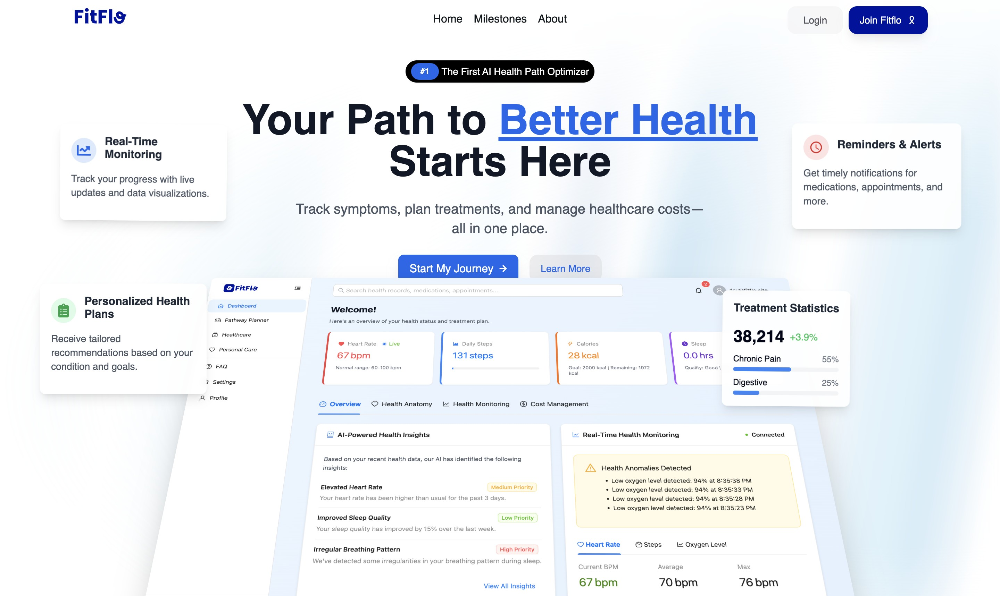
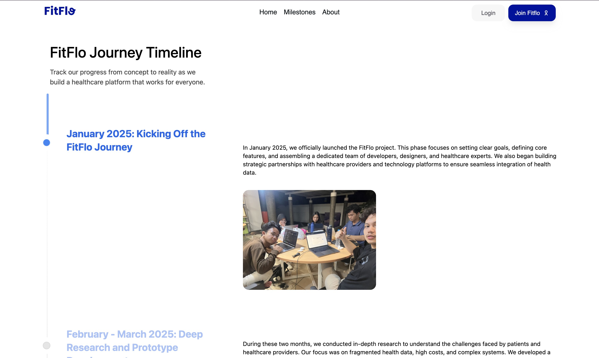
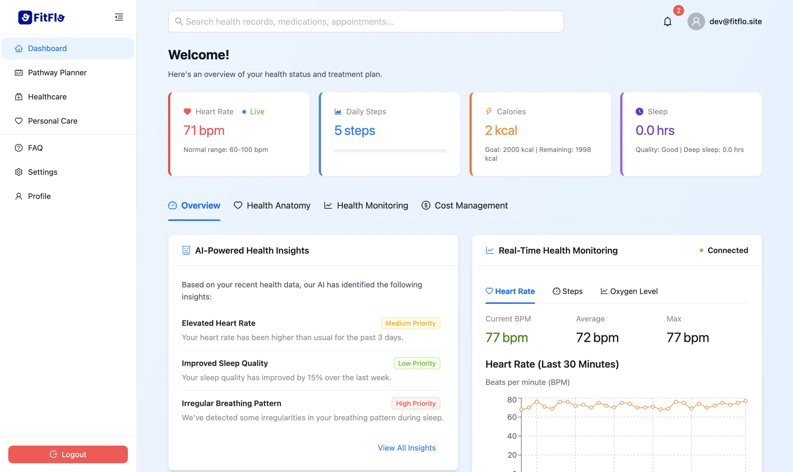
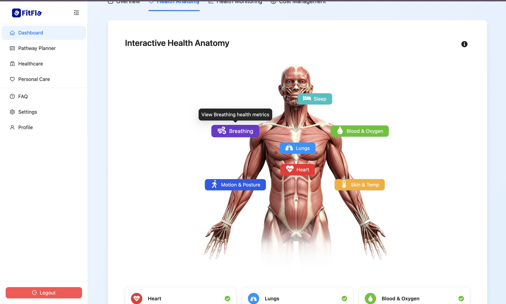
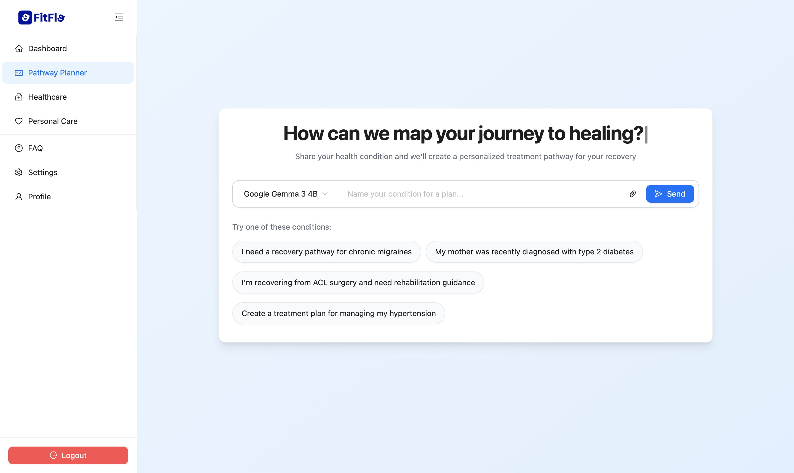

  
  <h1 align="center">FitFlo</h1>

## 📘 Project Overview
FitFlo is an AI-powered healthcare pathway planner designed to deliver a seamless and interactive user experience. This front-end, built with React and Vite, provides an intuitive interface for users to manage their health journeys, view personalized AI-driven recommendations, and navigate healthcare options with ease. It integrates visually rich components, smooth animations, and responsive design to enhance usability and engagement.

FitFlo is deployed on [fitflo.site](https://fitflo.site) and it's API (Back End) deployed on [api.fitflo.site](https://api.fitflo.site)

FitFlo Front-End Repository: [https://github.com/FitFlo-App/FitFlo-FE](https://github.com/FitFlo-App/FitFlo-FE) 
FitFlo Back-End Repository: [https://github.com/FitFlo-App/FitFlo-BE](https://github.com/FitFlo-App/FitFlo-BE)

  <!-- https://raw.githubusercontent.com/FitFlo-App/FitFlo-FE/main/ -->
  
  
  
  
  
  
  
  
  

## 🧱 Tech Stack Overview

### 🖥️ Frontend

- **Framework & Build Tool**  
  - React.js for front-end development  
  - Vite for fast development and optimized builds  

- **UI Components & Styling**  
  - **Ant Design** and **Hero UI** for pre-built components  
  - **Radix UI** for accessible and customizable UI elements  
  - **Tailwind CSS** for utility-first styling  
  - **ShadCN UI** for additional UI utilities  
  - **Lucide React** and **Tabler Icons** for iconography  

- **State Management & Routing**  
  - React Router for client-side navigation  

- **Animations & Interactivity**  
  - Framer Motion and Motion for smooth animations  
  - React Flow and XYFlow for interactive visualizations  

- **Data Handling & API Calls**  
  - Axios for making HTTP requests  
  - Recharts for data visualization  

- **Development & Tooling**  
  - TypeScript for type safety  
  - ESLint and Prettier for code quality and formatting  
  - Vite TSConfig Paths for module resolution  
  - PostCSS and Autoprefixer for CSS processing

### 🧩 API Backend

- **Backend Framework**: Node.js with Express
- **Database**: MongoDB, Intersystems IRIS
- **Authentication**: JWT-based authentication
- **AI Integration**: Qwen AI, Gemma, DeepSeek
- **APIs**: RESTful architecture

## 📝 License
This project is licensed under the MIT License.